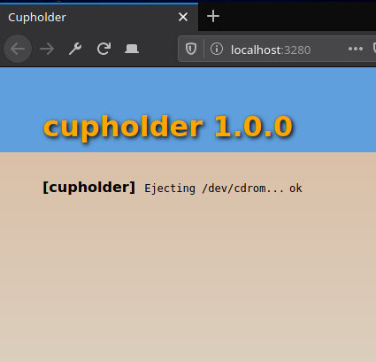

# cupholder   

Local or remote CD tray ejection, for Linux.

`cupholder` can be useful:

* If you have a large server room with many computers with CD trays, this can be used for finding a specific server.
* If you need an example for how to call `ioctls` from Go without using C (https://github.com/xyproto/cdrom/blob/main/cd.go).

## Usage

### With Docker

Run the container using this command:

    docker run -d --device /dev/cdrom:/dev/cdrom -p 3280:3280 --restart unless-stopped --name cupholder luois45/cupholder

And execute it by using as described in [Web server](https://github.com/Luois45/cupholder#web-server)

### Without Docker

    cupholder

Or when building a project that takes a while, as a notification utility:

    <build command>; cupholder

For specifying a specific device:

    cupholder /dev/cdrom

All arguments are treated as device filenames.

Use `-s` for silent operation and set the `NO_COLOR` environment variable to disable colors.

## Screenshot

## Web server

`cupholder` includes a web server that can be launched with the `-l` or `--listen` flag, that lets you eject the CD remotely, just by visiting the HTTP page at port 3280 (`3280 = 0x0CD0`) or at 3280 with /closetray attached to close the tray again.

For ejecting the tray using `curl`, a command like this can then be used:

    curl --silent --output /dev/null --write-out '%{http_code}\n' http://localhost:3280/

Replace `localhost` with the hostname or IP address of the server where `cupholder -l` is running.

## Requirements

* Go >= 1.10

## General info

* Version: 1.1.0
* License: GPL2
* Author: Alexander F. Rødseth &lt;xyproto@archlinux.org&gt;
